# VietNet2026 ERD

> Source of truth: `backend/src/modules/*/entities/*.entity.ts`. ERD la derived view, update cung commit khi sua entity. Ref: CROSS-0007

**Tong**: 20 entities, 11 modules
**Last sync**: 2026-04-18

---

## Module: users

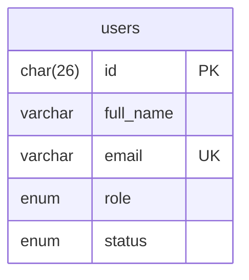

---

## Module: auth

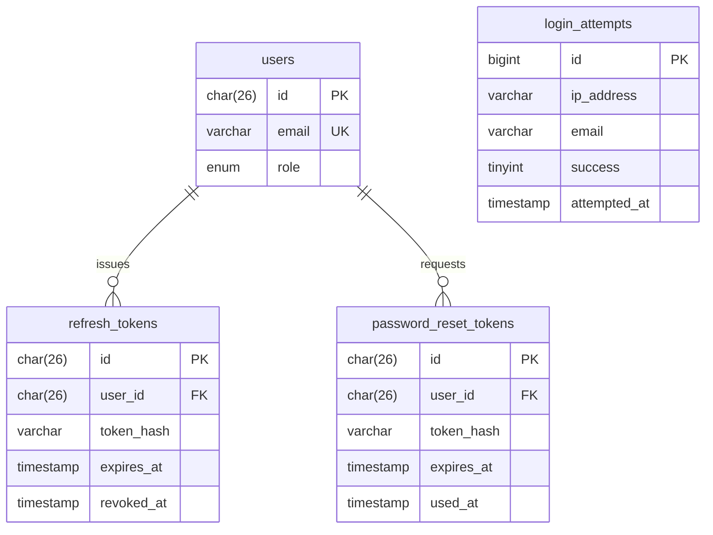

---

## Module: media

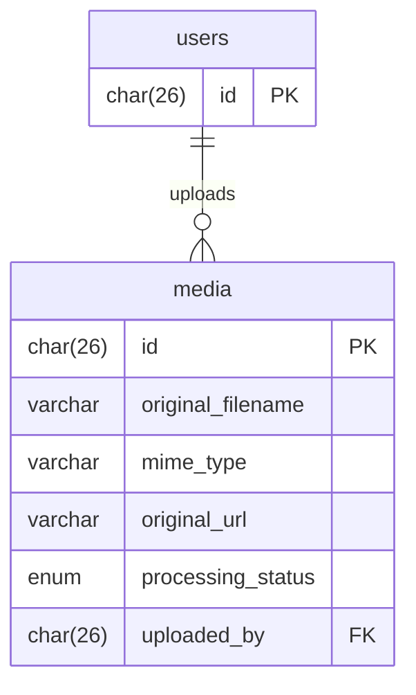

---

## Module: projects

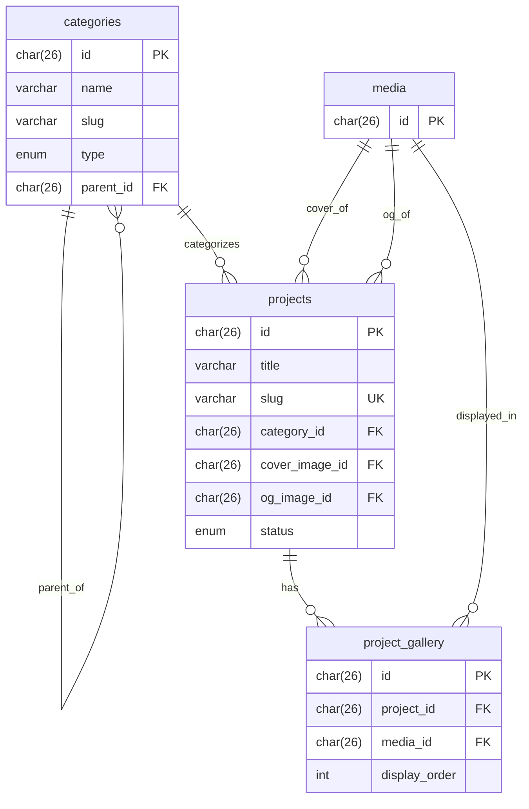

---

## Module: products

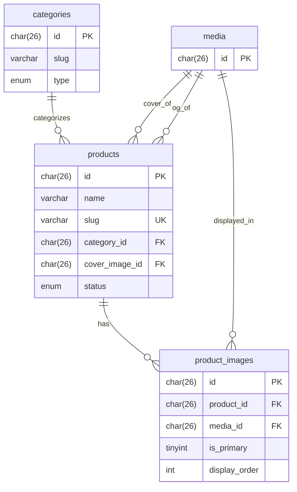

---

## Module: articles

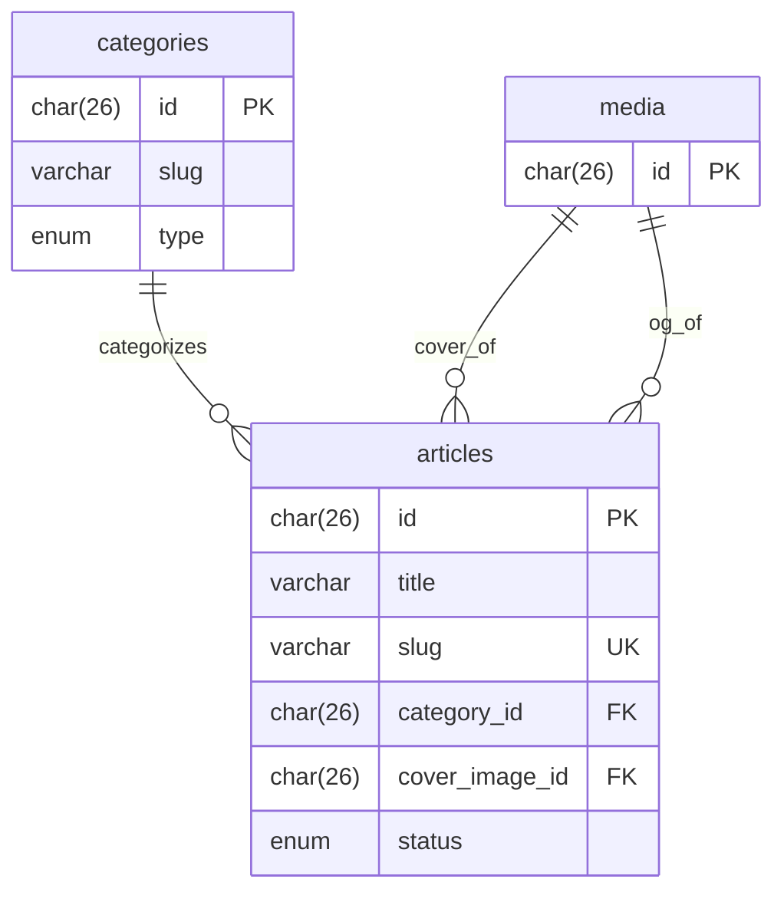

---

## Module: consultations

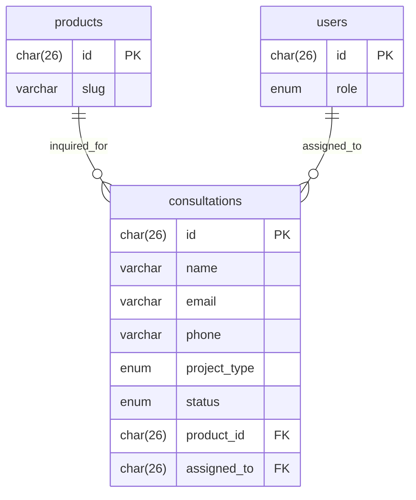

---

## Module: pages

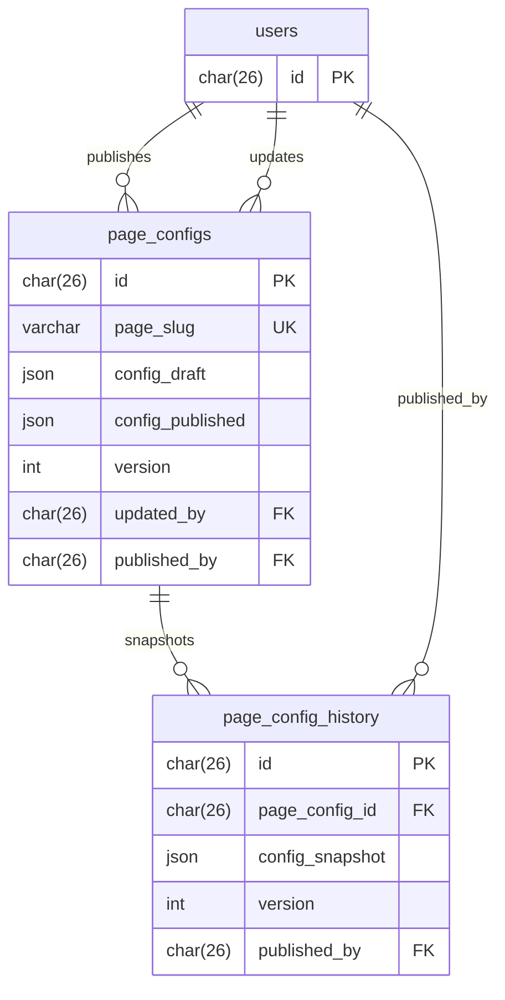

---

## Module: settings

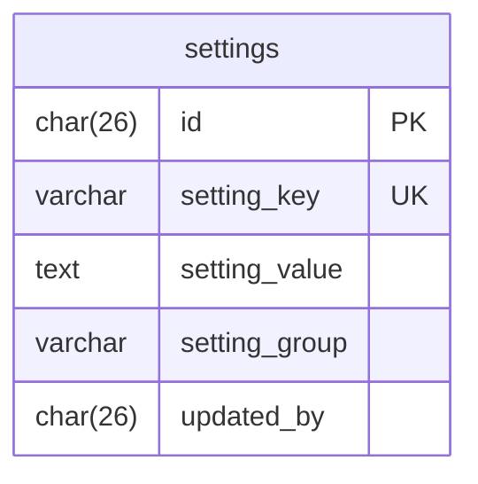

---

## Module: notifications

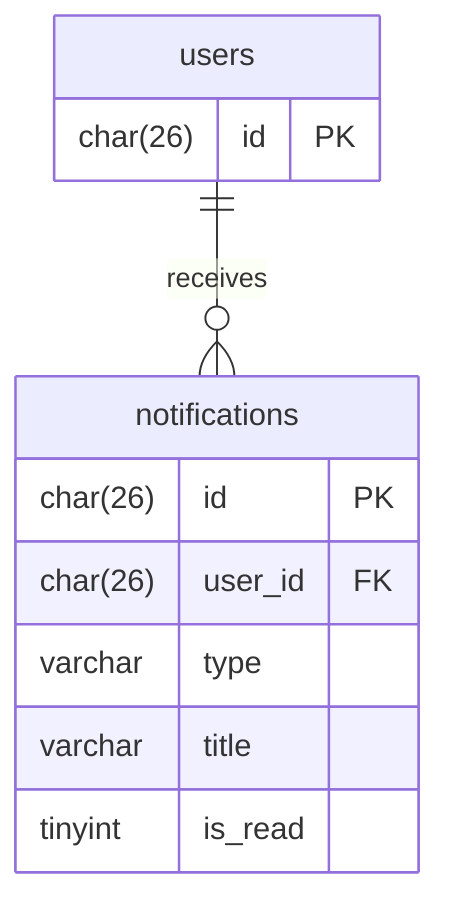

---

## Module: analytics

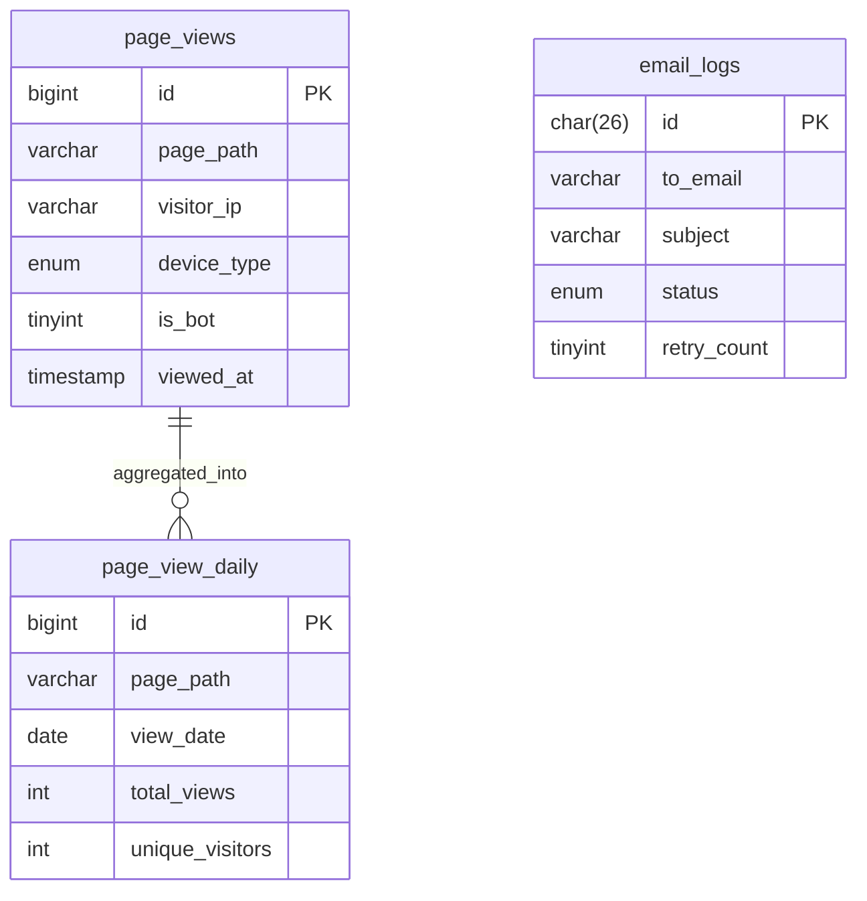

---

## Module: logs

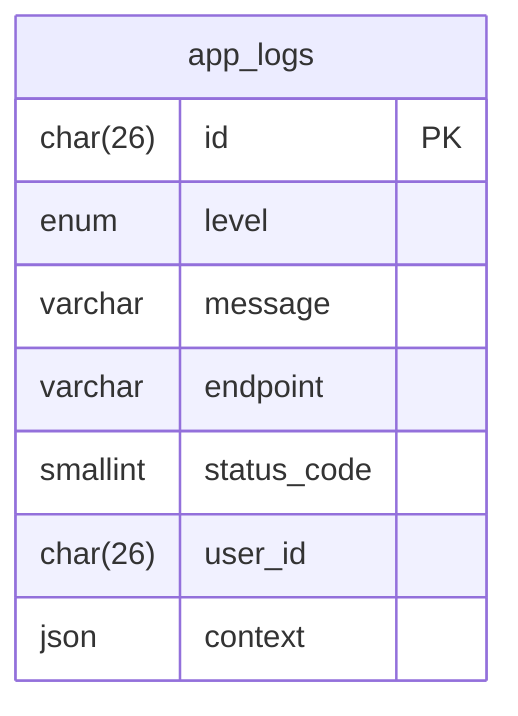
